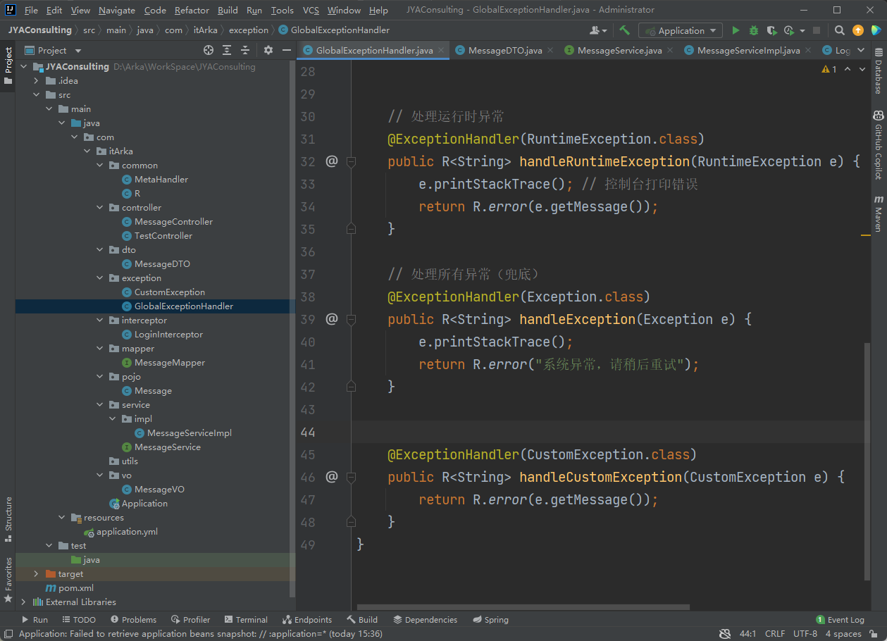
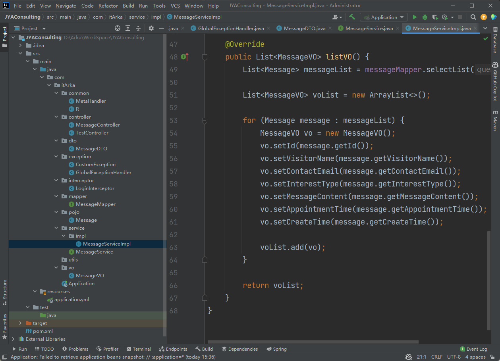
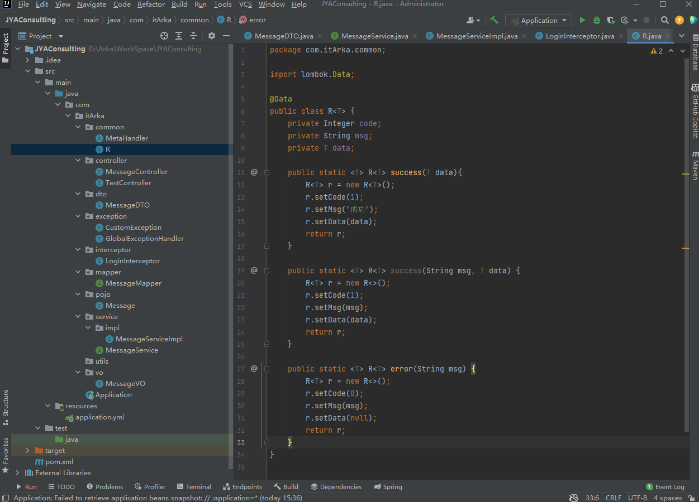

1 今天重写了 结果集 

2 了解了VO  DTO 的职责划分

vo  重在展示 决定前端能看到什么

dto 重在传输 决定后端能往前端传什么

pojo 重在 后端数据处理

3 重写了异常处理类 

简单重写了异常处理类，明白了为什么要抛出异常，而不是直接 return R.error。这样可以统一处理和查看异常，也是一种分层和解耦思想，我的理解是跟 AOP 有些类似。

4 重新复习了 Spring 的 IOC Bean 注入 原理之前就明白 今天继续看了一下具体流程 但是比较潦草

5 重写了登录的 Session

6 重新搭建了一个简单项目，分开了 VO、DTO、POJO，简单重写了部分工具类和结果集，比如 GlobalExceptionHandler、MetaController、LoginInterceptor。以理解为目的，以最低能运行为标准。

简单展示

