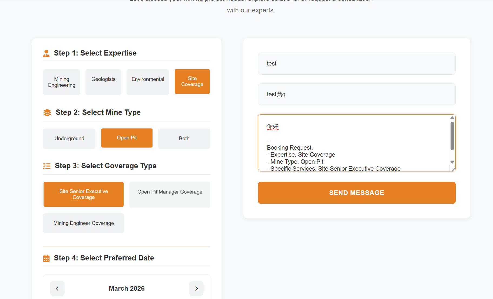
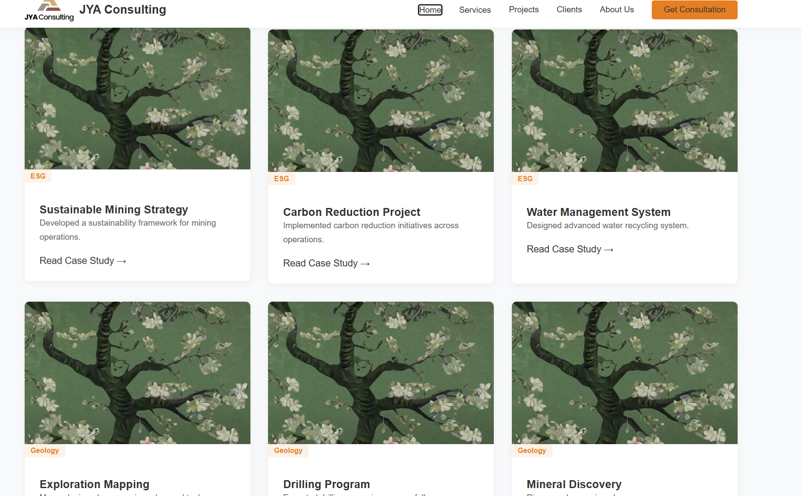
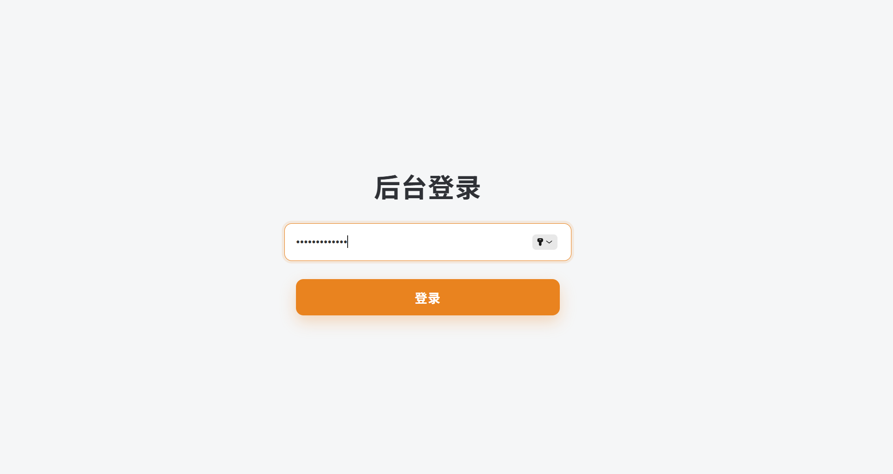
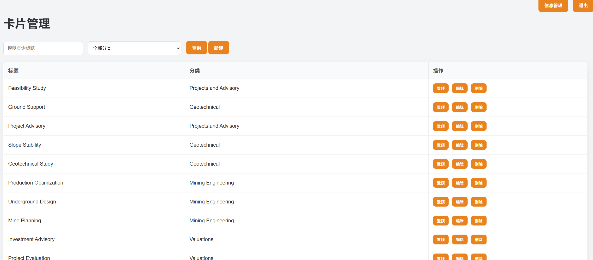
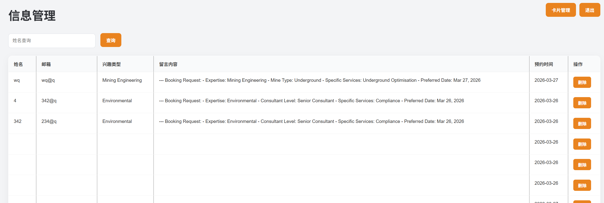

# 🚀 项目名称

**JYA Consulting 企业官网系统（全栈）**

------

## 📌 项目简介

这是一个面向海外矿业咨询公司的企业官网项目，采用**前后端分离架构**，我主要负责后端系统的设计与实现，并对接前端页面完成数据交互。

项目不仅实现了基础的官网展示功能，还重点搭建了一套**规范化后端架构体系**，包括统一返回结构、异常处理、参数校验、对象分层等，具备良好的可扩展性。

👉 本项目的核心价值不在“页面”，而在**后端工程化能力的实践**。


[----->点击访问我的网站<-----](https://jya-consulting.vercel.app/)

## 

------

## 🧱 技术栈

### 后端

- Java 17
- Spring Boot 3.x
- Spring MVC
- MyBatis-Plus
- MySQL
- Redis（预留/扩展）

### 前端（对接）

- HTML + CSS + JavaScript
- Axios（二次封装 request.js）

### 部署与运维

- Linux（Vultr 云服务器）
- Nginx（反向代理 + 静态资源托管）
- MinIO（对象存储，用于图片上传）

------

## 🧩 核心功能模块

### 1️⃣ 留言 / 咨询系统

- 用户可提交姓名、邮箱、咨询内容、预约时间
- 后端接收并存储数据（MySQL）
- 支持预约时间字段（时间类型处理）

👉 关键点：

- 解决 `LocalDateTime` 反序列化问题
- 前后端时间格式统一

------

### 2️⃣ 后台管理系统（简化版）

- 管理员登录（基于 Session）
- 留言数据查看
- 数据新增 / 编辑（可扩展删除）

👉 关键点：

- 使用拦截器实现登录校验
- 控制接口访问权限（白名单机制）

------

### 3️⃣ 文件上传系统（MinIO）

- 前端上传图片
- 后端转发到 MinIO 对象存储
- 返回可访问 URL

👉 关键点：

- 文件流处理
- MinIO URL 映射
- 前端资源访问路径统一

------

### 4️⃣ API 规范设计（重点）

项目不是“写接口”，而是**做规范**：

#### ✔ 统一返回结构

```java
R<T> {
  code,
  msg,
  data
}
```

#### ✔ 全局异常处理

- 参数校验异常
- 运行时异常
- 系统异常兜底

```java
@RestControllerAdvice
```

#### ✔ 参数校验

- @NotBlank
- @Email
- @Validated

👉 避免 Controller 写大量 if 判断

------

### 5️⃣ 分层架构设计

```
Controller → Service → Mapper → Database
```

并引入：

- DTO（接收参数）
- VO（返回数据）
- Entity（数据库映射）

👉 解决问题：

- 防止数据裸传
- 控制字段暴露
- 提高可维护性

------

## ⚙️ 工程能力亮点

### ⭐ 1. 接口规范化（不是CRUD）

- 统一返回结构
- 标准错误处理
- 清晰前后端协作边界

------

### ⭐ 2. 异常体系设计

- Controller 无业务 try-catch
- 错误自动上抛
- 全局统一处理

👉 接近真实企业开发模式

------

### ⭐ 3. 前后端分离实践

- Axios 封装 request.js
- API 模块化（login.js / message.js）
- 明确接口协议

------

### ⭐ 4. Nginx + 反向代理

- 解决跨域问题
- 前后端统一入口
- 支持多服务转发（Spring Boot + MinIO）

------

### ⭐ 5. 实际部署经验（加分项）

- 独立部署到云服务器
- 处理端口 / 跨域 / 静态资源问题
- 真实线上访问

👉 这一点吊打很多只会本地跑的同学

------

## 🚧 项目难点与解决

### ❗ 1. 时间格式问题（LocalDateTime）

- 问题：前端字符串无法直接反序列化
- 解决：统一格式 + Jackson 配置

------

### ❗ 2. 跨域问题

- 问题：前端 localhost 调后端 IP
- 解决：
  - Nginx 反向代理
  - 统一域名访问

------

### ❗ 3. 文件上传不可访问

- 问题：MinIO 使用 localhost
- 解决：改为服务器公网 IP

------

### ❗ 4. 登录鉴权

- 使用 Session + 拦截器
- 控制后台访问权限

------

## 📈 项目总结

这个项目的核心不是“做了个官网”，而是：

> 我开始具备了 **后端工程化能力 + 部署能力 + 前后端协作能力**

相比普通学生项目，我的提升在于：

- 不再写“裸接口”
- 开始有“系统设计意识”
- 理解真实项目运行流程（请求 → Nginx → 后端 → 数据库 → 返回）

------

## 🔥 下一步优化方向

- 接入 JWT（替代 Session）
- 引入 Spring Security
- 增加分页 / 条件查询
- 管理后台完善（CRUD + 权限）
- 上 HTTPS + 域名绑定
- 微服务拆分（未来）


简单展示










